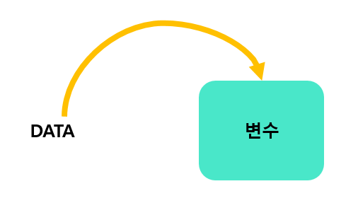

- 변수”
- 데이터를 저장할 수 있는 메모리 공간을 생성하는 것

변수의 메모리 공간은 프로그램이 실행될 때마다 바뀌며,

여러 개의 변수가 있을 때 서로 고유의 메모리 공간을 가지고 있습니다.

메모리 공간으로 해당 메모리에 저장된 값을 참조할 수 있으며,

변수를 생성하기 위해 메모리 공간의 크기를 지정해주는 자료형을 선언해야 합니다.

**DATA 변수**

“변수의 이름 규칙”

1. 변수의 경우 중복된 변수의 이름을 허용하지 않습니다. ex) int x = 10; ex) int x = 20;
2. 변수의 이름은 대소문자를 구분하여 사용할 수 있습니다. ex) int y = 10; ex) int Y = 20;
2. 변수의 이름으로 예약어를 사용할 수 없습니다. ex) int float= 20;
2. 변수의 이름은 숫자로 시작할 수 없습니다.

   ex) int directX9 = 10;

   ex) int 5direct = 20;

5. 변수의 이름으로 공백을 포함할 수 없습니다. ex) int Count Down = 10;
5. 변수의 이름으로 특수 문자는 \_만 사용할 수 있습니다. ex) int count\_Down = 10;

- 자료형”
- 데이터를 저장하기 위해 데이터의 형태를 정해주는 것입니다.

  자료형은 각각의 자료형마다 크기가 정해져 있으며, 

  자료형의 크기는 바이트 단위로 이루어져 있으며,

  자료형에 따라 저장할 수 있는 값의 종류와 범위가 결정되어 있습니다.

**자료형 이름 자료형의 크기 값을 저장할 수 있는 범위**

Bool 1byte

Byte 1byte

Char 1byte -128 ~ 127

Short 2byte -32,768 ~ 32,767

Int 4byte -2,147,483,648 ~ 2,147,483,647 Float 4byte

Double 8byte

Decimal 12byte

- 인터프리터 언어 vs 컴파일 언어”

1\. 컴파일 언어

컴파일 언어는 내가 작성한 소스 코드 전체를 기계어로 번역한 뒤, 이 번역된 코드를 한번에 실행하는 두 단계를 거쳐 진행된다. 

번역과 실행이 완전히 따로 이루어진다는 뜻이다. 

번역은 컴파일러를 통해 수행되고,

대표적인 예시로는 C, C++, java , Go 등이 있다.

* 특징 \*
1. 최초 컴파일이 오래 걸린다.

   ->하지만 이미 컴파일이 된 프로그램이라면? 굉장히 빠른 속도로 실행이 가능하다.

2. 컴파일 과정에서 코드 최적화와 오류 검사가 이루어지므로, 더 안정적이고 효율적인 프로그램을 만들 수 있습 니다
2. 운영체제 (OS) 이식성이 낮다.

->다른 환경에서 실행되기 위해서는 별도의 컴파일 과정이 또 필요하다.

2\. 인터프리터 언어

인터프리터 언어는 소스 코드를 한 줄씩, 번역과 실행을 동시에 진행하기 때문에 컴파일 과정이 필요하지 않습니다. 번역은 인터프리터를 통해 수행된다.

대표적인 예시로는 Python, R, JavaScript 등이 있다.

* 특징 \*
1. 줄 단위로 번역과 실행을 하기 때문에 실행이 느리다.
1. 오류를 발견하면 해당 코드 밑으로는 번역 및 실행을 못하기 때문에 오류 발견이 쉽다. ->개발의 편의성
1. 소스코드가 그대로 노출되기 때문에 코드 보안에 취약할 수 있다.
1. 운영체제 이식성이 좋다.

   -> OS마다 호환되는 인터프리터만 준비되어 있다면 바로 실행이 가능하다!
